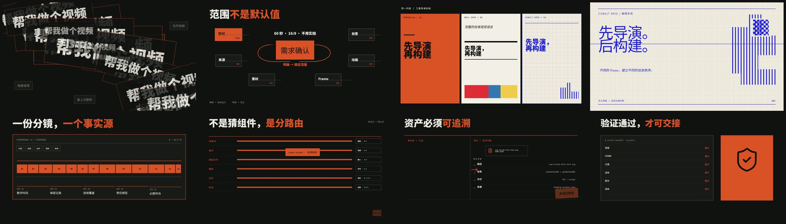

# mav-mg

[中文](README.md) · **English** · [Download skill](https://github.com/maverickgao8848/mav-mg/archive/refs/heads/main.zip) · [Watch the 60-second demo](https://github.com/maverickgao8848/mav-mg/raw/refs/heads/main/assets/showcase/hyperframes-curated-intake-demo-zh.mp4)

**Turn articles, scripts and ideas into directed MG animation plans using natural language.** Choose a visual direction below, review the complete storyboard, then hand it to HyperFrames for production.

[](https://github.com/maverickgao8848/mav-mg/raw/refs/heads/main/assets/showcase/hyperframes-curated-intake-demo-zh.mp4)

## Choose a Frame visually

Compare palette, type scale and composition here. Copy the preset name to use it; click an image for the full specification. These are illustrative studies with possible system font substitutions, not film stills.

<table>
<tr>
<td width="50%"><a href="assets/library/frames/biennale-yellow/FRAME.md"></a><br><b>Biennale Yellow</b><br>Culture / exhibitions / ideas<br><code>biennale-yellow</code></td>
<td width="50%"><a href="assets/library/frames/bmw-m-engineered-contrast/FRAME.md"></a><br><b>BMW M Engineered Contrast</b><br>Blue / red stripes · engineering / performance<br><code>bmw-m-engineered-contrast</code></td>
</tr>
<tr>
<td width="50%"><a href="assets/library/frames/broadside/FRAME.md"></a><br><b>Broadside</b><br>Manifestos / bold opinions / launches<br><code>broadside</code></td>
<td width="50%"><a href="assets/library/frames/cartesian/FRAME.md"></a><br><b>Cartesian</b><br>Methods / consulting / clear explanations<br><code>cartesian</code></td>
</tr>
<tr>
<td width="50%"><a href="assets/library/frames/cobalt-grid/FRAME.md"></a><br><b>Cobalt Grid</b><br>Research / data / AI and systems<br><code>cobalt-grid</code></td>
<td width="50%"><a href="assets/library/frames/dell-1996/FRAME.md"></a><br><b>Dell 1996</b><br>Retro tech / internet culture / playful products<br><code>dell-1996</code></td>
</tr>
<tr>
<td width="50%"><a href="assets/library/frames/ferrari-editorial-chiaroscuro/FRAME.md"></a><br><b>Ferrari Editorial Chiaroscuro</b><br>Premium brands / portraits / editorial stories<br><code>ferrari-editorial-chiaroscuro</code></td>
</tr>
</table>

## Get started

Download and unzip the package above. Rename the extracted folder to `mav-mg` and place the entire folder in your project's `.agents/skills/` directory. The repository root is the skill: SKILL.md, READMEs, license, scripts, schemas and assets travel together.

With Python 3.11+, run this inside the skill folder:

```powershell
python -m pip install -r requirements.txt
```

Open your project in Codex, paste the source and ask:

```text
Use mav-mg to plan a 60-second MG explainer from this article.
Use cobalt-grid for an audience new to the topic.
Recommend passages to animate, review the full storyboard with me,
then hand it to HyperFrames for production.
```

Existing choices carry forward; unresolved questions are grouped together. Provide the material, choose a direction, and approve one complete storyboard. The skill binds real assets, records provenance and licenses, and verifies the handoff. Build and render require HyperFrames and Node.js separately.

[Skill instructions](SKILL.md) · [Provenance and rights](assets/library/provenance/talkcraft-partner-authorization.md)

## License and commercial use

The repository is offered under the [PolyForm Noncommercial License 1.0.0](LICENSE). Personal study, research, experimentation, hobby work, qualifying educational use, and other noncommercial purposes are permitted by the license. **Any anticipated commercial application—including client work, paid services, company production, or product integration—requires a separate commercial license.**

To request one, open a repository Issue titled `Commercial License Request / 商业授权申请` and briefly describe the licensee, intended use, distribution scope, and a safe way to contact you. Do not post sensitive information in a public Issue.

Individual third-party library entries may also carry their own provenance and license metadata. Check those terms before use or redistribution. The full `LICENSE` text controls if this summary differs from it.
