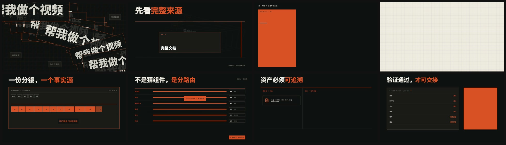

# HyperFrames Curated Intake

**不用写代码，也能把文章、脚本和想法变成有导演感的 MG 动画。** 这个仓库提供一套面向 Codex / AI Agent 的策划 Skill，以及已经筛选、标注和可追溯的 HyperFrames 视觉素材库。你只需要说清楚想讲什么、给谁看、喜欢哪种风格；Curated Intake 会把模糊想法整理成经过确认的 Storyboard、视觉方向、动效范围和可验证的制作交接。

**Create directed MG animation without learning to code.** This repository packages a Codex / AI-agent planning skill and a curated, traceable HyperFrames production library. Bring an article, script, notes, or an idea; describe the audience and choose a visual direction. Curated Intake turns that intent into an approved storyboard, visual system, motion scope, and verified production handoff.

[中文](#中文) · [English](#english) · [观看一分钟成片 / Watch the 60-second film](docs/media/hyperframes-curated-intake-demo-zh.mp4) · [许可证 / License](LICENSE)

[](docs/media/hyperframes-curated-intake-demo-zh.mp4)

> 点击上图观看仓库内的 60 秒、1080p 成片。Click the image to watch the 60-second, 1080p film stored in this repository.

---

## 中文

### 它解决什么问题

传统 MG 动画通常要在文案、分镜、视觉设计、动效、素材管理和技术实现之间来回沟通。真正昂贵的往往不是“让东西动起来”，而是反复猜测：这句话该怎么画、哪些地方值得动画、风格能否保持一致、素材能否合法复用、交给制作后会不会走样。

Curated Intake 把这些判断集中在制作前完成：

- **零代码表达。** 用自然语言给出文章、口播稿、产品介绍或一句想法，不需要理解 HTML、JavaScript 或动画时间轴。
- **先确认，再生产。** 先选来源范围、Frame 风格和需要动画的段落，再共同确认整条片子的 Storyboard，减少昂贵返工。
- **超低边际成本。** 复用 8 套 Frame、41 个 Block、121 个 Component 和 202 个 SVG 预览；同一套流程可以持续生产新内容。
- **有审美，不是套模板。** Frame 规定色彩、排版、留白、构图和镜头气质；每个场景仍根据内容重新导演。
- **可追溯、可交接。** 被选中的组件、来源、许可证、哈希和缺失项都会进入交接记录，并在进入制作前验证。
- **适合多种画幅。** Frame 文档同时描述 16:9、9:16 和 1:1 的重排原则，可用于横版讲解、竖版短视频和社交媒体方形内容。

### 你可以怎么用

把仓库作为 Codex workspace 打开后，直接描述结果即可。例如：

```text
用 hyperframes-curated-intake 把这篇文章做成 60 秒中文 MG 动画。
受众是第一次接触这个产品的人。先给我推荐 3 个 Frame，说明各自气质；
只动画最关键的 6 个段落，Storyboard 经我确认后再交给 HyperFrames 制作。
```

也可以从一个很小的请求开始：

```text
我不会写代码。请先读这份口播稿，告诉我哪些句子最值得做动画，
再用 Cobalt Grid 和 Broadside 各给一个视觉方向，不要开始渲染。
```

典型流程只有四个用户可理解的阶段：

1. 提供材料与目标：文章、脚本、笔记、受众、时长和发布平台。
2. 选择视觉方向：比较 Frame，圈定真正需要动画的内容。
3. 审阅整条 Storyboard：一次看清每个场景讲什么、怎么画、怎么动。
4. 确认后交接：Skill 绑定真实素材并验证交接，后续由 HyperFrames 完成构建和渲染。

### 8 种 Frame 风格

Frame 不是一张固定模板，而是一套可以跨场景保持统一的视觉语法。点击名称可查看每套风格完整的配色、排版、构图、画幅适配与自检规则。

| 风格 | 第一眼感受 | 适合内容 | 谨慎使用 |
| --- | --- | --- | --- |
| [Biennale Yellow](.agents/skills/hyperframes-curated-intake/assets/library/frames/biennale-yellow/FRAME.md) | 羊皮纸、深靛蓝、太阳黄；策展与文化感 | 艺术、文化、研究、展览、思想型叙事 | 不适合高饱和科技霓虹或密集 UI |
| [BMW M Engineered Contrast](.agents/skills/hyperframes-curated-intake/assets/library/frames/bmw-m-engineered-contrast/FRAME.md) | 近黑、硬边、机械精度、冷静力量 | 工程、汽车、硬件、性能、技术发布 | 不适合温柔生活方式或儿童内容 |
| [Broadside](.agents/skills/hyperframes-curated-intake/assets/library/frames/broadside/FRAME.md) | 黑橙撞色、巨型粗体、海报冲击 | 宣言、观点、发布、节奏强的短片 | 长段正文会削弱它的冲击力 |
| [Cartesian](.agents/skills/hyperframes-curated-intake/assets/library/frames/cartesian/FRAME.md) | 暖石色、古典衬线、几何秩序 | 咨询、框架、方法论、优雅解释 | 不适合电竞、故障艺术或强促销感 |
| [Cobalt Grid](.agents/skills/hyperframes-curated-intake/assets/library/frames/cobalt-grid/FRAME.md) | 奶油纸、电钴蓝、网格与像素细节 | 数据、研究、AI、系统与产品解释 | 不适合奢华暗调或写实电影叙事 |
| [Dell 1996](.agents/skills/hyperframes-curated-intake/assets/library/frames/dell-1996/FRAME.md) | 90 年代目录、贴纸、彩色卡片、复古网页 | 怀旧科技、互联网文化、趣味产品故事 | 不适合严肃奢侈品或极简企业片 |
| [Ferrari Editorial Chiaroscuro](.agents/skills/hyperframes-curated-intake/assets/library/frames/ferrari-editorial-chiaroscuro/FRAME.md) | 暖黑、强明暗、稀缺红色、高级编辑感 | 品牌、汽车、奢侈品、人物与高端发布 | 红色必须克制；不适合轻快信息流 |
| [Runway Editorial Cinema](.agents/skills/hyperframes-curated-intake/assets/library/frames/runway-editorial-cinema/FRAME.md) | 黑色电影底、克制界面、单点薄荷绿 | AI、创意工具、影像、未来感产品故事 | 不适合多彩儿童向或电商大促 |

每个 `FRAME.md` 的开头都有双语“风格速览”，方便非设计背景的用户在阅读完整规范前快速做选择。

### 安装与验证

最低要求：Python 3.11+；进入 HyperFrames 构建与渲染阶段时需要 Node.js。

```powershell
git clone https://github.com/maverickgao8848/hyperframes-curated-intake-library.git
cd hyperframes-curated-intake-library
python -m pip install -e .
pytest -q
```

在 Codex 中打开克隆后的目录。发布版 Skill 位于 `.agents/skills/hyperframes-curated-intake/`，规范入口是 [`SKILL.md`](.agents/skills/hyperframes-curated-intake/SKILL.md)。

### 仓库里有什么

- `.agents/skills/hyperframes-curated-intake/`：Skill 指令、工作流、Schema、验证脚本，以及唯一的生产素材库。
- `.agents/skills/hyperframes-curated-intake/assets/library/frames/`：8 套可选择的 Frame 视觉语言。
- `.agents/skills/hyperframes-curated-intake/assets/library/registry/`：可安装的 Blocks 与 Components。
- `.agents/skills/hyperframes-curated-intake/assets/library/previews/`：素材预览与索引。
- `docs/media/`：一分钟成片、封面和镜头概览。
- `schemas/` 与 `tests/`：共享 Schema 与回归验证。

### 许可与商业授权

本仓库整体使用 [PolyForm Noncommercial License 1.0.0](LICENSE)。个人学习、研究、实验、爱好项目以及符合许可证定义的教育和其他非商业用途可以使用、修改和分发；**任何预期商业应用、为公司或客户制作内容、收费服务、商业产品集成或其他商业用途，都应先申请单独的商业授权。**

申请方式：在本仓库提交一个标题为 `Commercial License Request / 商业授权申请` 的 Issue，简要说明使用主体、使用场景、预计发布范围和联系方式。不要在公开 Issue 中填写敏感信息。

素材库中的第三方条目仍可能带有各自的来源与许可证元数据；使用或再分发前请同时检查对应条目。若摘要与 `LICENSE` 正文存在差异，以正文为准。

---

## English

### What it fixes

The expensive part of MG animation is rarely the final render. It is the repeated guessing between writing, storyboarding, visual design, motion direction, asset clearance, and implementation. Curated Intake moves those decisions to the beginning of the process:

- **No coding required.** Work in natural language with an article, voice-over script, notes, product brief, or a single idea.
- **Approve before production.** Lock source scope, Frame, and animated passages before the full storyboard is handed to production.
- **Low marginal cost.** Reuse 8 Frames, 41 Blocks, 121 Components, and 202 SVG previews across many videos.
- **Directed, not template-bound.** A Frame holds color, typography, composition, spacing, and image behavior together while each scene is still directed for its content.
- **Traceable handoff.** Selected assets, provenance, licenses, hashes, and catalog misses are recorded and verified.
- **Multiple aspect ratios.** Frame guidance covers 16:9, 9:16, and 1:1 reflow behavior.

### Start with a conversation

Open the repository as a Codex workspace and ask for the outcome you want:

```text
Use hyperframes-curated-intake to turn this article into a 60-second MG explainer.
The audience is new to the product. Recommend three Frames and explain the trade-offs.
Animate only the six most important passages, and wait for my storyboard approval
before handing the project to HyperFrames.
```

The user-facing flow is simple: provide the material and goal, choose a visual direction, review one complete storyboard, then approve the verified production handoff. Curated Intake deliberately stops before composition authoring and rendering so creative approval remains meaningful.

### Visual directions

The eight Frame documents linked above are the canonical style specifications. In short: Biennale Yellow is curatorial and cultural; BMW M is engineered and severe; Broadside is loud editorial poster design; Cartesian is restrained and analytical; Cobalt Grid is research-led and digital; Dell 1996 is playful retro technology; Ferrari is premium chiaroscuro; and Runway is minimal editorial cinema.

Each `FRAME.md` opens with a bilingual style snapshot covering its mood, best-fit content, signature devices, and common mismatch. The full document remains the production authority for tokens, composition, motion boundaries, aspect ratios, and pre-render checks.

### Install and verify

Requirements: Python 3.11+; Node.js is needed later for HyperFrames build and render workflows.

```powershell
git clone https://github.com/maverickgao8848/hyperframes-curated-intake-library.git
cd hyperframes-curated-intake-library
python -m pip install -e .
pytest -q
```

Open the cloned directory as a Codex workspace. The released skill is at `.agents/skills/hyperframes-curated-intake/`, with [`SKILL.md`](.agents/skills/hyperframes-curated-intake/SKILL.md) as its entry point.

### Repository map

- `.agents/skills/hyperframes-curated-intake/`: instructions, references, schemas, scripts, and the canonical production library.
- `assets/library/frames/` inside the skill: eight visual systems.
- `assets/library/registry/` inside the skill: installable Blocks and Components.
- `assets/library/previews/` inside the skill: asset previews and indexes.
- `docs/media/`: the one-minute film, poster, and contact sheet.
- `schemas/` and `tests/`: shared schema and regression verification.

Local production work belongs under `projects/` and is intentionally ignored. Promote only maintained, redistributable examples into a versioned public location.

### License and commercial use

The repository is offered under the [PolyForm Noncommercial License 1.0.0](LICENSE). Personal study, research, experimentation, hobby work, qualifying educational use, and other noncommercial purposes are permitted by the license. **Any anticipated commercial application—including client work, paid services, company production, or product integration—requires a separate commercial license.**

To request one, open a repository Issue titled `Commercial License Request / 商业授权申请` and briefly describe the licensee, intended use, distribution scope, and a safe way to contact you. Do not post sensitive information in a public Issue.

Individual third-party library entries may also carry their own provenance and license metadata. Check those terms before use or redistribution. The full `LICENSE` text controls if this summary differs from it.

## Contributing and verification

Run the repository-level check before publishing a change:

```powershell
pytest -q
```

When the library changes, update its catalog, provenance, preview, registry projection, and license metadata together. See [CONTRIBUTING.md](CONTRIBUTING.md) for the collaboration checklist.
