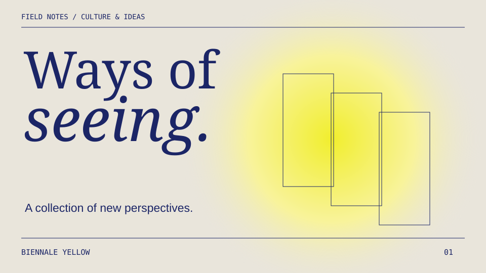
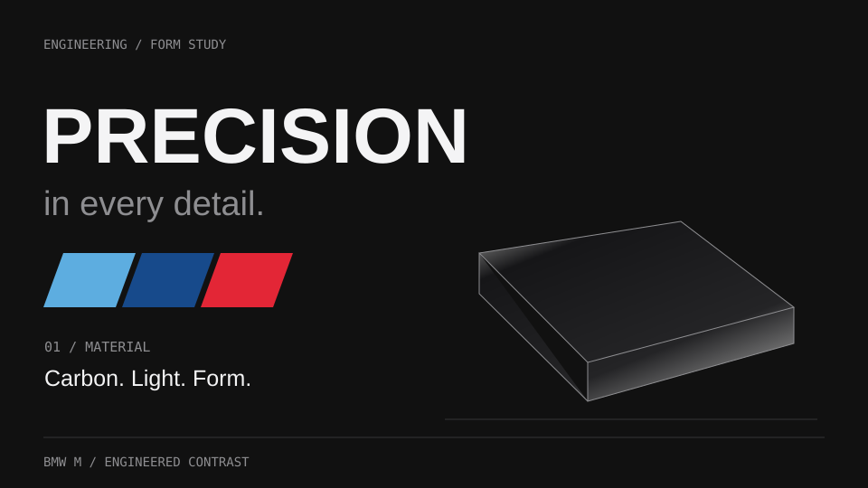
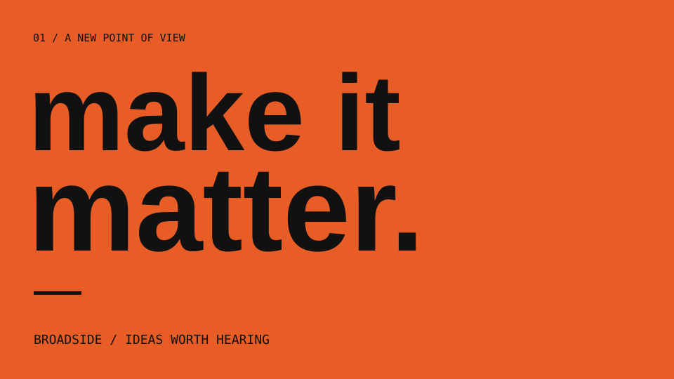
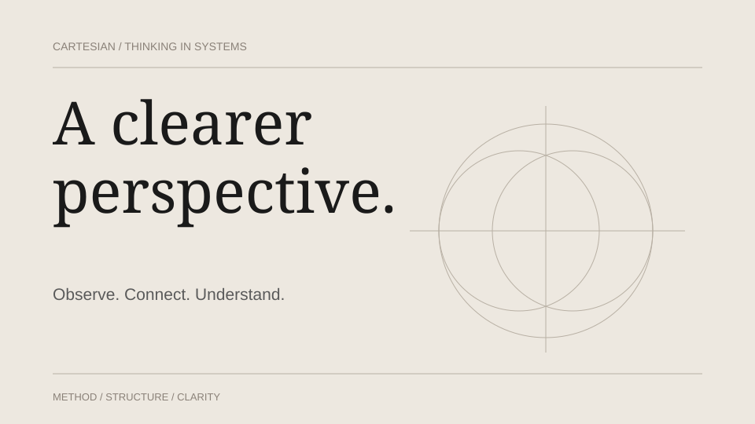
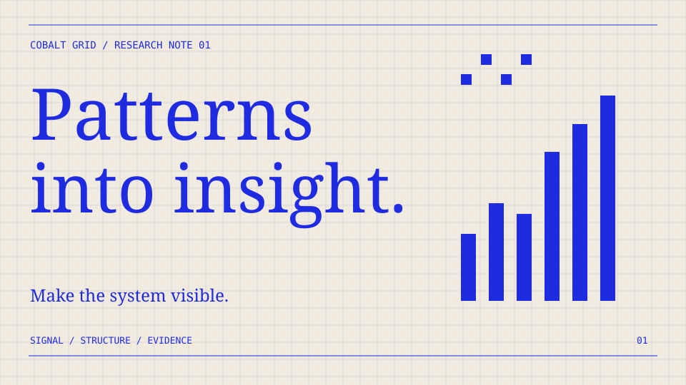
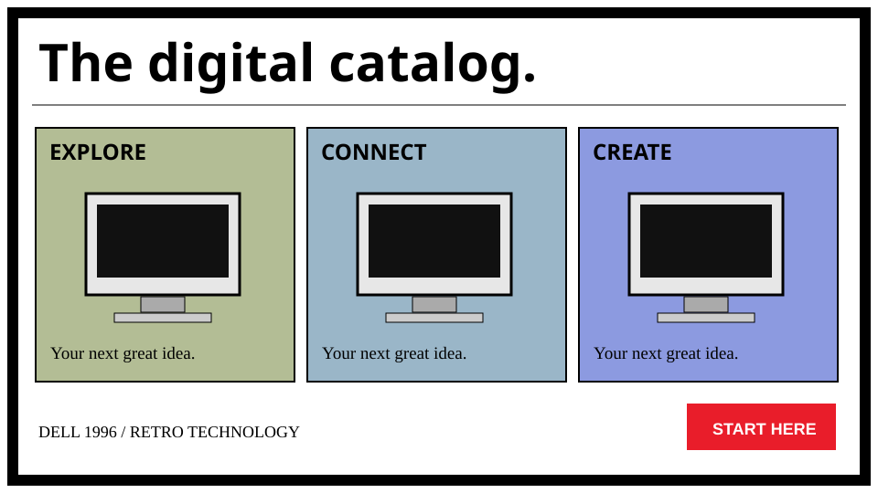
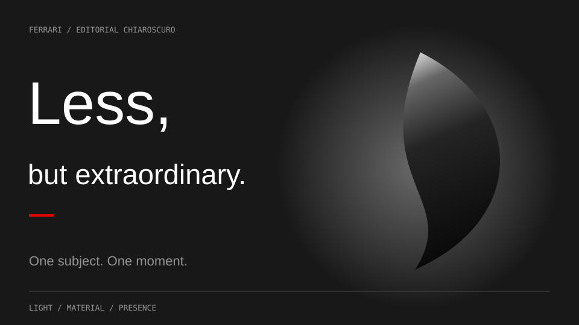

# Frame visual gallery / 风格画廊

Illustrative studies of palette and composition; typography may use system fallbacks.
These are selection aids, not rendered client work. The linked FRAME.md remains authoritative.

<table>
<tr>
<td width="50%"> <b>Biennale Yellow</b> 策展 / 文化 / 思想 <code>biennale-yellow</code></td>
<td width="50%"> <b>BMW M Engineered Contrast</b> 红蓝斜带 · 工程 / 硬件 / 性能 <code>bmw-m-engineered-contrast</code></td>
</tr>
<tr>
<td width="50%"> <b>Broadside</b> 宣言 / 观点 / 强节奏发布 <code>broadside</code></td>
<td width="50%"> <b>Cartesian</b> 方法论 / 咨询 / 结构化解释 <code>cartesian</code></td>
</tr>
<tr>
<td width="50%"> <b>Cobalt Grid</b> 研究 / 数据 / AI 与系统 <code>cobalt-grid</code></td>
<td width="50%"> <b>Dell 1996</b> 复古科技 / 互联网文化 / 趣味产品 <code>dell-1996</code></td>
</tr>
<tr>
<td width="50%"> <b>Ferrari Editorial Chiaroscuro</b> 高端品牌 / 人物 / 编辑叙事 <code>ferrari-editorial-chiaroscuro</code></td>
</tr>
</table>
